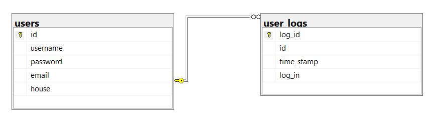
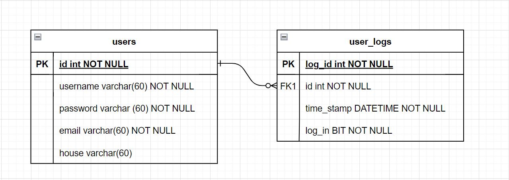
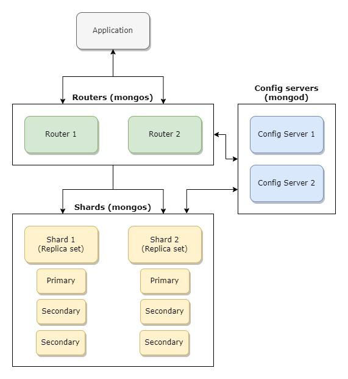

# Database + AI eksamensprojekt
## Gruppemedlemmer
* Benjamin Ritthidech Sommervoll (CPH-BS202)
* Line Phoebe Wienke (*)
* Louise Sitting Estrup (*)

## Projektbeskrivelse
Formålet med dette projekt er at skabe en chatbot, der er i stand til at besvare spørgsmål om Harry Potter universet. Chatbotten skal hente informationer fra en database omhandlende bøgerne, filmene og andre relaterede medier for at give svar.


## Application Domain
### Use cases

### Functional requirements
- Chatbotten skal kunne svare på spørgsmål relateret til Harry Potter
- Brugere skal kunne se tidligere interaktioner med chatbotten (Chat historik)
### Non functional requirements
- Hurtig respons
- Skal kunne være fejl tolerante (queues)
- Skal have høj tilgængelighed
- Skalerbarhed
- 4 Forskellige database typer
    - NoSQL Database
    - Relationel Database (SQL)
    - Graph Database
    - Vector Database


## Henting af Harry Potter data
Vi henter al vores data omkring Harry Potter og universet fra denne side: https://harrypotter.fandom.com/wiki/Main_Page. Her starter vi med at gå ind på siderne omkrig de syv (main) bøger og derfra tager info om dem, samt alle links på de sider, hvorefter vi går ind på de link tager information om de sider plus links vi ikke alledrede har i forvejen. Dette bliver gjort i Harry_Potter_chatbot_get_info notebooken hvor funtioner til at hente fra siderne ligger i myloadlib.py. Efter at have hentet i ukendt tid, fik vi en connection error men valgt at vi havde nok info med de 21996 dokumenter vi havde hentet. Alle dokumenterne bliver lagt i en jsonl film, som ligger under data mappen men ikke på github da den fylder over 100Mb, her kan de så blive brugt i andre notebooks.

## Streamlit app
For at vise vores chatbot og dens funktioner har vi lavet en frontend med Streamlit.
Den åbnes gennem cmd:
```
streamlit run main.py --client.showSidebarNavigation=False
```
# sider
Vores Streamlit app har tre sider:
- Main page hvor man kan logge ind og når man er logget ind har man adgang til chatbotten.
- create user page hvor man kan oprette en ny bruger
- update user page hvor man kan opdatere informationer når man er logget ind
# Databaser
Projektet indeholder 4 forskellige typer databaser:
* SQL (MSSQL)
* NoSQL (MongoDB)
* Graph (Neo4J)
* Vector (Chroma)

Databaserne er sat op med Docker, testede operations systemer er:
* Windows 11 + 4.30.0 (149282)

## Vector database (Chroma)
Vi bruger en vector database til at opbevare informationen til chatbotten.
### Opsætning af Vector database
1. ```
    docker run -p 8000:8000 -d --name chromadb chromadb/chroma:latest 
    ```
### Vector database funktioner
I Vector_database_functions filen ligger alle vores funktioner til at tilgå databasen
- vi kan oprette en ny collection og smide data ind i den
- tilføje data til den, hvis der skulle komme ny information
- hente databasen så vi kan bruge den
- update informationen på en key, hvis vi skulle have brug for at opdatere
- slette på en key
- slette på den sidste key
- slette hele collectionen

## Graph database (Neo4J) 
Som vores graph database bruger vi Neo4j. Vi bruger graph databasen til at kunne se realationer mellem fx karakterene fra bøgerne.
#### Opsætning af Graph database
Vi bruger Neo4J 5.20 Community Edition
Website: localhost:7474
Username: neo4j
Password: neo4j
1. ```
    docker run --name neo4jdb --publish=7474:7474 --publish=7687:7687 --env=NEO4J_dbms_security_procedures_unrestricted=algo.*,apoc.* --env NEO4J_apoc_export_file_enabled=true --env NEO4J_apoc_import_file_enabled=true --env NEO4J_apoc_import_file_use__neo4j__config=true --env NEO4J_ACCEPT_LICENSE_AGREEMENT=yes  --env NEO4J_PLUGINS='["apoc", "graph-data-science"]' --volume=$HOME/neo4j/plugins:/plugins --volume=$HOME/neo4j/data:/data -d neo4j:5.20.0
    ```

#### Transformere til graph
Vi bruger Diffbot til at transformere vores text data vi har hentet om til en graph. Vi har valgt at bruge det fordi det er hurtigere og nemmere end selv at skulle gennemgå de over 20000 dokumenter vi har hentet og lave noder og realationer. Dog ville det være bedst hvis vi selv gjorde det, da diffbot har nogle forud indstillinger som ikke er de bedste til vores text. Bla. kunne det være at vi havde brug for noder til besværgelser (fra bøgerne).

### graph schema
### graph algoritmer 

## SQL database (MSSQL)
Vi bruger SQL database til vores brugersystem, hvor vi også logger når en bruger logger ind eller ud af systemet. Disse funktioner er opdelt i to tables, users og user_log. 




#### Opsætning af MSSQL database
Vi bruger SQL Server 2022 CU12
1. ```
    docker run -e "ACCEPT_EULA=Y" -e "MSSQL_SA_PASSWORD=StrPass2222123" -p      1433:1433 -d --name mssql-server mcr.microsoft.com/mssql/server:2022-CU12-ubuntu-22.04	
    ```
## NoSQL (MongoDB)
Vores MongoDB opsætning består af:
* 2 config server
* 2 routers
* 2 Shards (Replica sets)



### Opsætning af MongoDB database
Vi bruger MongoDB version 7.0.
1. Opret netværk for alle mongo services 
    - ```
        docker network create mongo-db-network
        ```
2. Opret 2 config servers
    - ```
        docker run -d --net mongo-db-network --name config-server-1 -p 27101:27017 mongo:7.0 mongod --port 27017 --configsvr --replSet config-server-replSet
        docker run -d --net mongo-db-network --name config-server-2 -p 27102:27017 mongo:7.0 mongod --port 27017 --configsvr --replSet config-server-replSet
        ```
3. Initialize config replica sets
    - ```
        docker exec -it config-server-1 mongosh
        rs.initiate({_id: "config-server-replSet", configsvr: true, members: [ { _id: 0, host: "config-server-1:27017" }, { _id: 1, host: "config-server-2:27017" }]})
        ```
4. Create shards
    - ```
        docker run -d --net mongo-db-network --name shard-1-node-a -p 27111:27017 mongo:7.0 mongod --port 27017 --shardsvr --replSet shard-1-replSet 
        docker run -d --net mongo-db-network --name shard-1-node-b -p 27121:27017 mongo:7.0 mongod --port 27017 --shardsvr --replSet shard-1-replSet 
        docker run -d --net mongo-db-network --name shard-1-node-c -p 27131:27017 mongo:7.0 mongod --port 27017 --shardsvr --replSet shard-1-replSet
        ```
    - ```
        docker run -d --net mongo-db-network --name shard-2-node-a -p 27112:27017 mongo:7.0 mongod --port 27017 --shardsvr --replSet shard-2-replSet 
        docker run -d --net mongo-db-network --name shard-2-node-b -p 27122:27017 mongo:7.0 mongod --port 27017 --shardsvr --replSet shard-2-replSet 
        docker run -d --net mongo-db-network --name shard-2-node-c -p 27132:27017 mongo:7.0 mongod --port 27017 --shardsvr --replSet shard-2-replSet
        ```
5. Initialize shard replica sets
    - ```
        docker exec -it shard-1-node-a mongosh
        rs.initiate({_id: "shard-1-replSet", members: [{ _id: 0, host: "shard-1-node-a:27017" }, { _id: 1, host: "shard-1-node-b:27017" }, { _id: 2, host: "shard-1-node-c:27017" }] })
        ```
    - ```
        docker exec -it shard-2-node-a mongosh
        rs.initiate({_id: "shard-2-replSet", members: [{ _id: 0, host: "shard-2-node-a:27017" }, { _id: 1, host: "shard-2-node-b:27017" }, { _id: 2, host: "shard-2-node-c:27017" }] })
        ```
6. Create routers
    - ```
        docker run -d --net mongo-db-network --name router-1 -p 27141:27017 mongo:7.0 mongos --port 27017 --configdb config-server-replSet/config-server-1:27017,config-server-2:27017,config-server-3:27017 --bind_ip_all
        docker run -d --net mongo-db-network --name router-2 -p 27142:27017 mongo:7.0 mongos --port 27017 --configdb config-server-replSet/config-server-1:27017,config-server-2:27017,config-server-3:27017 --bind_ip_all
        ```
7. Add shards to router
    - ```
        docker exec -it router-1 mongosh
        sh.addShard("shard-1-replSet/shard-1-node-a:27017", "shard-1-replSet/shard-1-node-b:27017", "shard-1-replSet/shard-1-node-c:27017")
        sh.addShard("shard-2-replSet/shard-2-node-a:27017", "shard-2-replSet/shard-2-node-b:27017", "shard-2-replSet/shard-2-node-c:27017")
        ```
    - ```
        docker exec -it router-2 mongosh
        sh.addShard("shard-1-replSet/shard-1-node-a:27017", "shard-1-replSet/shard-1-node-b:27017", "shard-1-replSet/shard-1-node-c:27017")
        sh.addShard("shard-2-replSet/shard-2-node-a:27017", "shard-2-replSet/shard-2-node-b:27017", "shard-2-replSet/shard-2-node-c:27017")
        ```


### Funtioner til mongo 
- I vores Database har vi en collection til vores chat histore. Deri har den et selvsat id, user_id, user_input, ai_input, og et timestamp. Det giver brugerne mulighed for at kunne se de spørgmål de har stillet samt svar de har fået, og vi kan set det og hvornår de er blevet stillet. 
- Gennem streamlit appen kan vi hente chathistorikken for brugeren ved det id. funtionen ligger i /streamlit/MongoDB.py.
- vi kan tilføje mere data til den gennem funktionen InsertChatHistory i /streamlit/MongoDB.py. Den bliver kaldt når chatbotten har svaret på et spørgsmål.
- vi kan slette dataen for en specifik bruger med delete_chat_history i /streamlit/MongoDB.py. Den bliver kaldt når brugeren bliver slettet i bruger databasen.
- vi har valgt ikke at have en update funtion da vi ikke mener at der skal kunne opdateres i chat historikken. 


# LLM