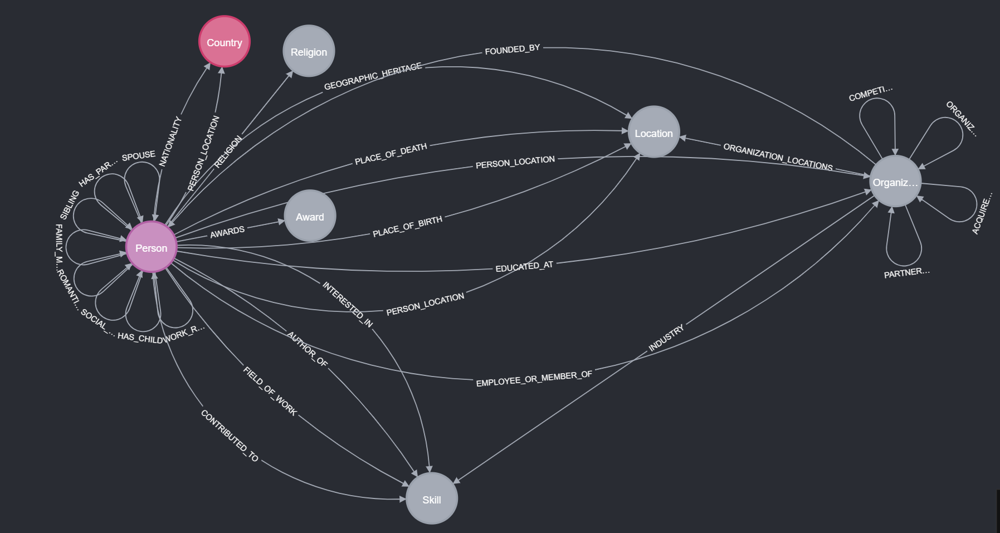
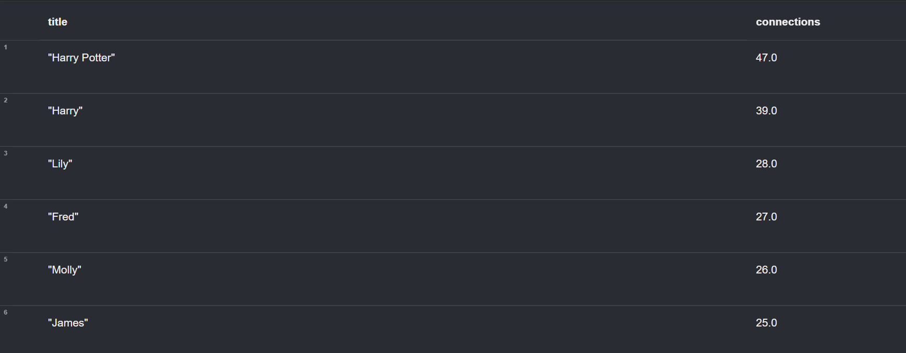
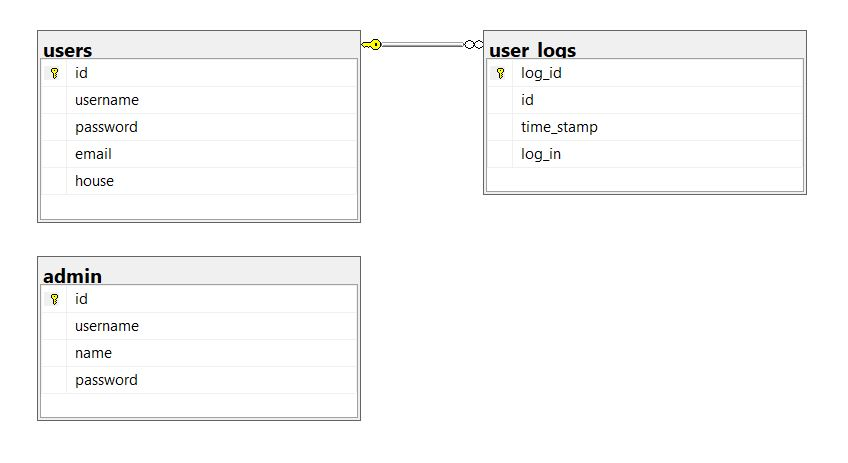
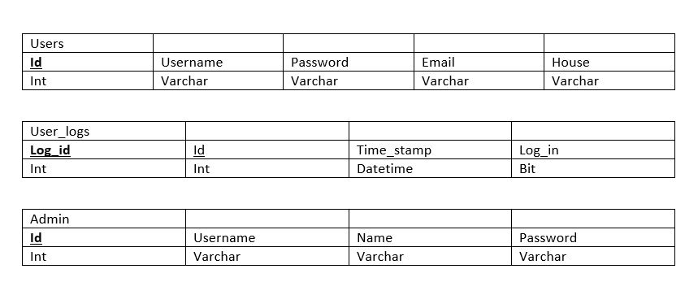
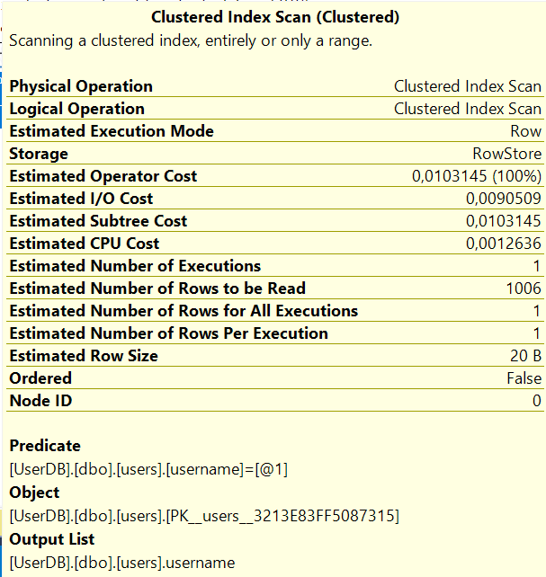
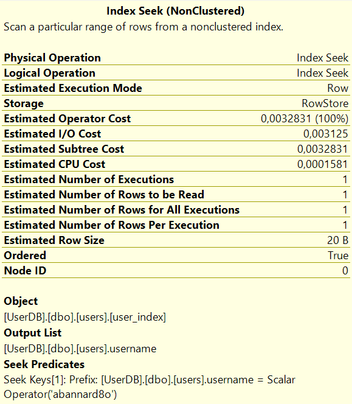
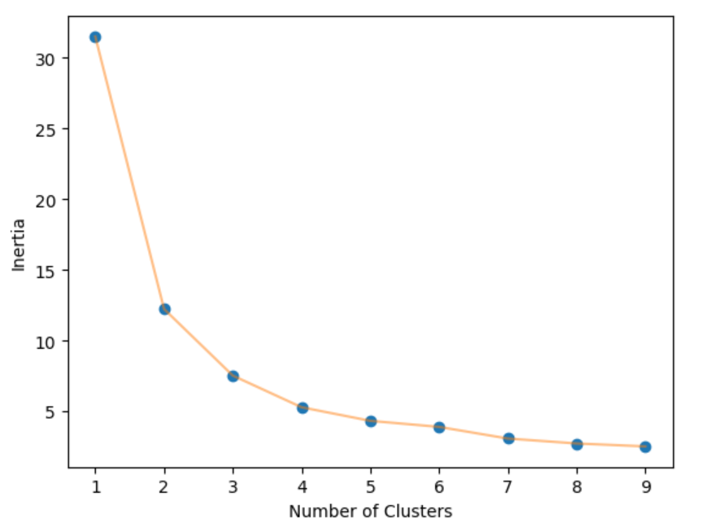
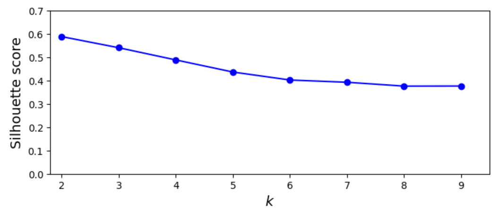
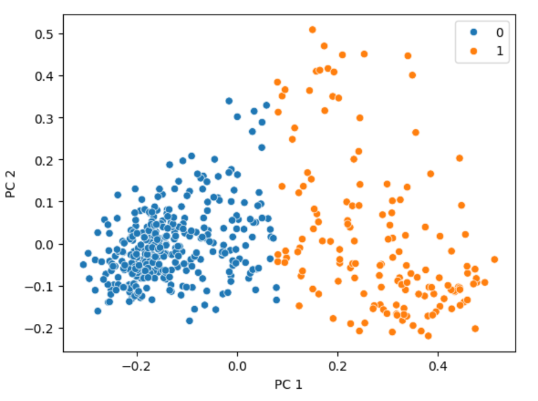
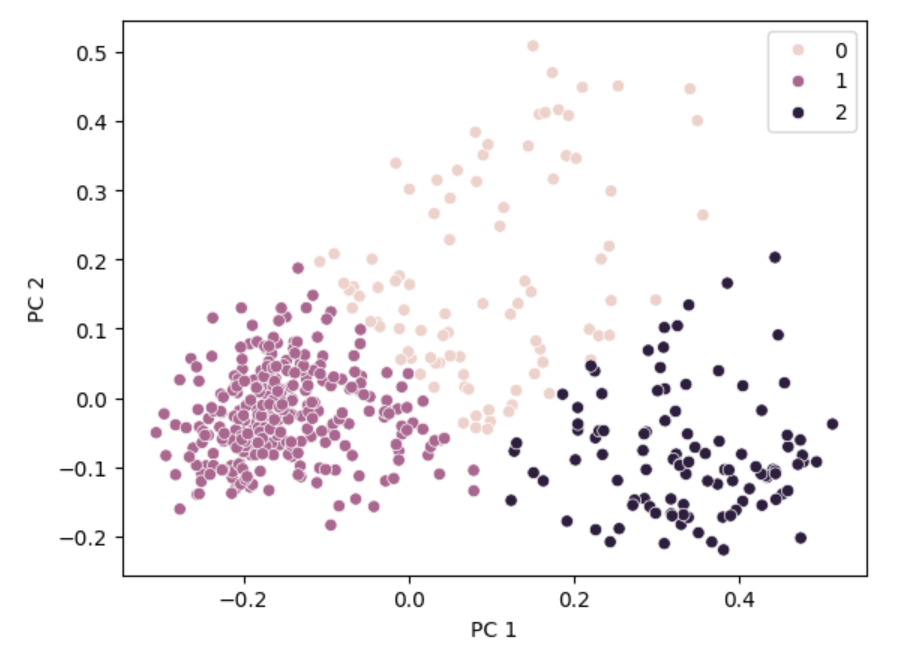

# Database + AI eksamensprojekt
- [Intro](#database--ai-eksamensprojekt)
- [Databaser](#Databaser)
- [AI](#ai)
## Gruppemedlemmer
* Benjamin Ritthidech Sommervoll (CPH-BS202)
* Line Phoebe Wienke (CPH-lw146)
* Louise Sitting Estrup (CPH-LE115)

## Projektbeskrivelse
Formålet med dette projekt er at skabe en chatbot, der er i stand til at besvare spørgsmål om Harry Potter universet. Chatbotten skal hente informationer fra en database omhandlende bøgerne, filmene og andre relaterede medier for at give svar.


## Application Domain
### Use cases
- brugeren skal kunne spørge chatbotten om spørgmål
- brugeren skal kunne få svar fra chatbotten
- brugeren skal kunne logge ind
- brugeren skal kunne logge ud
- brugeren skal kunne opdatere sin email og sit password
- brugeren skal kunne slette sin konto
- brugeren skal kunne se sin chat historik
- admin skal kunne se brugere
- admin skal kunne se logs over login og logout
### Functional requirements
- Chatbotten skal kunne svare på spørgsmål relateret til Harry Potter
- Brugere skal kunne se tidligere interaktioner med chatbotten (Chat historik)
### Non functional requirements
- Hurtig respons
- Skal kunne være fejl tolerante (queues)
- Skal have høj tilgængelighed
- Skalerbarhed
- 4 Forskellige database typer
    - NoSQL Database
    - Relationel Database (SQL)
    - Graph Database
    - Vector Database


## Henting af Harry Potter data
Vi henter al vores data omkring Harry Potter og universet fra denne side: https://harrypotter.fandom.com/wiki/Main_Page. Her starter vi med at gå ind på siderne omkrig de syv (main) bøger og derfra tager info om dem, samt alle links på de sider, hvorefter vi går ind på de link tager information om de sider plus links vi ikke alledrede har i forvejen. Dette bliver gjort i Harry_Potter_chatbot_get_info notebooken hvor funtioner til at hente fra siderne ligger i myloadlib.py. Efter at have hentet i ukendt tid, fik vi en connection error men valgt at vi havde nok info med de 21996 dokumenter vi havde hentet. Alle dokumenterne bliver lagt i en jsonl fil, som ligger under data mappen men ikke på github da den fylder over 100Mb, her kan de så blive brugt i andre notebooks.

## Streamlit app
For at vise vores chatbot og dens funktioner har vi lavet en frontend med Streamlit.
Den åbnes gennem cmd:
```
streamlit run main.py --client.showSidebarNavigation=False
```
### sider
Vores Streamlit app har fire sider:
- Main page hvor man kan logge ind og når man er logget ind har man adgang til chatbotten.
- create user page hvor man kan oprette en ny bruger
- update user page hvor man kan opdatere informationer når man er logget ind
- en admin page hvor folk med admin rettigheder har mulighed for at se alle brugere og logs
# Databaser
Projektet indeholder 4 forskellige typer databaser:
* SQL (MSSQL)
* NoSQL (MongoDB)
* Graph (Neo4J)
* Vector (Chroma)

Databaserne er sat op med Docker, testede operations systemer er:
* Windows 11 + 4.30.0 (149282)

## Vector database (Chroma)
Vi bruger en vector database til at opbevare informationen til chatbotten.
### Opsætning af Vector database
1. ```
    docker run -p 8000:8000 -d --name chromadb chromadb/chroma:latest 
    ```
### Vector database funktioner
I Vector_database_functions filen ligger alle vores funktioner til at tilgå databasen
- vi kan oprette en ny collection og smide data ind i den
- tilføje data til den, hvis der skulle komme ny information
- hente databasen så vi kan bruge den
- update informationen på en key, hvis vi skulle have brug for at opdatere
- slette på en key
- slette på den sidste key
- slette hele collectionen

## Graph database (Neo4J) 
Som vores graph database bruger vi Neo4j. Vi bruger graph databasen til at kunne se realationer mellem fx karakterene fra bøgerne.
#### Opsætning af Graph database
Vi bruger Neo4J 5.20 Community Edition
Website: localhost:7474
Username: neo4j
Password: neo4j
1. ```
    docker run --name neo4jdb --publish=7474:7474 --publish=7687:7687 --env=NEO4J_dbms_security_procedures_unrestricted=algo.*,apoc.* --env NEO4J_apoc_export_file_enabled=true --env NEO4J_apoc_import_file_enabled=true --env NEO4J_apoc_import_file_use__neo4j__config=true --env NEO4J_ACCEPT_LICENSE_AGREEMENT=yes  --env NEO4J_PLUGINS='["apoc", "graph-data-science"]' --volume=$HOME/neo4j/plugins:/plugins --volume=$HOME/neo4j/data:/data -d neo4j:5.20.0
    ```

#### Transformere til graph
Vi bruger Diffbot til at transformere vores text data vi har hentet om til en graph. Vi har valgt at bruge det fordi det er hurtigere og nemmere end selv at skulle gennemgå de over 20000 dokumenter vi har hentet og lave noder og realationer. Dog ville det være bedst hvis vi selv gjorde det, da diffbot har nogle forud indstillinger som ikke er de bedste til vores text. Bla. kunne det være at vi havde brug for noder til besværgelser (fra bøgerne).

### graph schema
Med graph schema kan vi danne os et overblik over de noder og relationships der er i vores graph database. 

Her kan vi se at der er følgende noder i databasen:
- Person, 
  - har en masse relationship til sig selv, spouse, Has_parrent, Sibling, Family_member, Romatic_instrest, Social_relation, Has_child, Work_relation. 
  - Den har awards mod award. 
  - Religion mod Religion. 
  - Person_location og nationality mod country. 
  - Geographic_heritage, place_of_death, place_of_birth, person_location mod Location
  - Person_location, Educated_at, employee_or_member_of mod Organization
  - intersted_in, author_of, field_of_work, contributed_to mod Skill
- Organization
    - Competitors, Organization_Locations, acquired_by, partnership mod sigselv 
    - Founded_by mod Person
    - Organization_locations mod Location
    - Industry mod skill
- Contry
- Religion
- Award
- Location
- Skill


### graph algoritmer
vi undersøgte grafen ved at prøve at finde ud af hvem der var i centrum, ved at kigge på personer og sociale relation, og fandt ud af at Harry Potter var den med flest relationer hvilket giver god mening.




## SQL database (MSSQL)
Vi bruger SQL database til vores brugersystem, hvor vi også logger når en bruger logger ind eller ud af systemet. Disse funktioner er opdelt i to tables, users og user_log. 




### Opsætning af MSSQL database
Vi bruger SQL Server 2022 CU12
1. Åben terminal i mappen "Docker" 
2. ```
    docker build -t ai_db_sql_docker . --no-cache
    ```
2. ```
    docker run -e "ACCEPT_EULA=Y" -e "MSSQL_SA_PASSWORD=StrPass2222123" -p 1433:1433 -d --name mssql-server ai_db_sql_docker	
    ```
### user data
for at have noget data i vores database lavede vi en masse fake data ved hjælp af https://www.mockaroo.com/, hvor vi fik den til at generere username, email og password for os. De generede filer ligger user data.sql.

### View
Vi har lavet et view kaldet user info, som tager id, username, email og house fra user table, da vi gerne vil have information uden password, da admin skal kunne se informationerne uden at se passwordet. 

### Index
Vi har lavet et index på username collonen i users tabellen, da vi har brug for at gennem søge den, når en ny bruger vil oprette sig da username skal være unikt. Vi har lavet Indexet, tog et random username, og sammenligende qurryen:
- SELECT username FROM dbo.users WHERE username = 'abannard8o' 
med 
- SELECT username FROM dbo.users WITH (INDEX(user_index)) WHERE username = 'abannard8o'. 

 


Det er tydeligt at se at værdierne er væsenligt laver, og at indexet er godt at have med. 

## NoSQL (MongoDB)
Vores MongoDB opsætning består af:
* 2 config server
* 2 routers
* 2 Shards (Replica sets)


### Opsætning af MongoDB database
Vi bruger MongoDB version 7.0.
1. Opret netværk for alle mongo services 
    - ```
        docker network create mongo-db-network
        ```
2. Opret 2 config servers
    - ```
        docker run -d --net mongo-db-network --name config-server-1 -p 27101:27017 mongo:7.0 mongod --port 27017 --configsvr --replSet config-server-replSet
        docker run -d --net mongo-db-network --name config-server-2 -p 27102:27017 mongo:7.0 mongod --port 27017 --configsvr --replSet config-server-replSet
        ```
3. Initialize config replica sets
    - ```
        docker exec -it config-server-1 mongosh
        rs.initiate({_id: "config-server-replSet", configsvr: true, members: [ { _id: 0, host: "config-server-1:27017" }, { _id: 1, host: "config-server-2:27017" }]})
        ```
4. Create shards
    - ```
        docker run -d --net mongo-db-network --name shard-1-node-a -p 27111:27017 mongo:7.0 mongod --port 27017 --shardsvr --replSet shard-1-replSet 
        docker run -d --net mongo-db-network --name shard-1-node-b -p 27121:27017 mongo:7.0 mongod --port 27017 --shardsvr --replSet shard-1-replSet 
        docker run -d --net mongo-db-network --name shard-1-node-c -p 27131:27017 mongo:7.0 mongod --port 27017 --shardsvr --replSet shard-1-replSet
        ```
    - ```
        docker run -d --net mongo-db-network --name shard-2-node-a -p 27112:27017 mongo:7.0 mongod --port 27017 --shardsvr --replSet shard-2-replSet 
        docker run -d --net mongo-db-network --name shard-2-node-b -p 27122:27017 mongo:7.0 mongod --port 27017 --shardsvr --replSet shard-2-replSet 
        docker run -d --net mongo-db-network --name shard-2-node-c -p 27132:27017 mongo:7.0 mongod --port 27017 --shardsvr --replSet shard-2-replSet
        ```
5. Initialize shard replica sets
    - ```
        docker exec -it shard-1-node-a mongosh
        rs.initiate({_id: "shard-1-replSet", members: [{ _id: 0, host: "shard-1-node-a:27017" }, { _id: 1, host: "shard-1-node-b:27017" }, { _id: 2, host: "shard-1-node-c:27017" }] })
        ```
    - ```
        docker exec -it shard-2-node-a mongosh
        rs.initiate({_id: "shard-2-replSet", members: [{ _id: 0, host: "shard-2-node-a:27017" }, { _id: 1, host: "shard-2-node-b:27017" }, { _id: 2, host: "shard-2-node-c:27017" }] })
        ```
6. Create routers
    - ```
        docker run -d --net mongo-db-network --name router-1 -p 27141:27017 mongo:7.0 mongos --port 27017 --configdb config-server-replSet/config-server-1:27017,config-server-2:27017,config-server-3:27017 --bind_ip_all
        docker run -d --net mongo-db-network --name router-2 -p 27142:27017 mongo:7.0 mongos --port 27017 --configdb config-server-replSet/config-server-1:27017,config-server-2:27017,config-server-3:27017 --bind_ip_all
        ```
7. Add shards to router
    - ```
        docker exec -it router-1 mongosh
        sh.addShard("shard-1-replSet/shard-1-node-a:27017", "shard-1-replSet/shard-1-node-b:27017", "shard-1-replSet/shard-1-node-c:27017")
        sh.addShard("shard-2-replSet/shard-2-node-a:27017", "shard-2-replSet/shard-2-node-b:27017", "shard-2-replSet/shard-2-node-c:27017")
        ```
    - ```
        docker exec -it router-2 mongosh
        sh.addShard("shard-1-replSet/shard-1-node-a:27017", "shard-1-replSet/shard-1-node-b:27017", "shard-1-replSet/shard-1-node-c:27017")
        sh.addShard("shard-2-replSet/shard-2-node-a:27017", "shard-2-replSet/shard-2-node-b:27017", "shard-2-replSet/shard-2-node-c:27017")
        ```


### Funtioner til mongo 
- I vores Database har vi en collection til vores chat histore. Deri har den et selvsat id, user_id, user_input, ai_input, og et timestamp. Det giver brugerne mulighed for at kunne se de spørgmål de har stillet samt svar de har fået, og vi kan set det og hvornår de er blevet stillet. 
- Gennem streamlit appen kan vi hente chathistorikken for brugeren ved det id. funtionen ligger i /streamlit/MongoDB.py.
- vi kan tilføje mere data til den gennem funktionen InsertChatHistory i /streamlit/MongoDB.py. Den bliver kaldt når chatbotten har svaret på et spørgsmål.
- vi kan slette dataen for en specifik bruger med delete_chat_history i /streamlit/MongoDB.py. Den bliver kaldt når brugeren bliver slettet i bruger databasen.
- vi har valgt ikke at have en update funtion da vi ikke mener at der skal kunne opdateres i chat historikken. 
- Vi har lavet en aggregation pipeline til at kunne filtrer og lægge antallet af chats for en enkelte bruger sammen, den ligger i funktionen get_number_of_chats i /streamlit/MongoDB.py.


# AI
## Problem statement 
Hvordan kan vi udvikle en chatbot som har viden om Harry Potter universet, således at brugere af vores side nemmere kan holde styr på Harry Potter universet?

## Motivation 
At hjælpe fans af Harry Potter med at navigere seriens univers, ved at de kan stille en chatbot om spørgsmål der relaterer til Harry Potter universet. Folk i litteratur branchen kan også bruge vores hjemmeside til at  foretage research fx ift. at skrive nyt materiale eller at drage inspiration fra serien.
Vi ville gerne udvikle en chatbot i forbindelse med at vi skulle arbejde på vores eksamensprojekt. Vi valgte at fokusere på et bestemt emne, for at indskrænke projektets scope, og bedre definere projektet. 
Det var Lines idé at fokusere specifikt på Harry Potter, da hun er stor fan af serien.

## Research Questions
1. Kan vi træne en ml model til at svare på spørgsmål om harry potter?
2. Hvordan kan vi indsamle data om Harry Potter til en chatbot?
3. Hvordan kan vi sikre at chatbotten leverer korrekte svar?


## Theoretical foundation
### LLM
En large language model (LLM), er en type AI program, som er i stand til at genkende og generere tekst. Disse modeller er trænet med enorme datasæt, og bygger på machine learning gennem en type af neural network. 
Large language models anvender deep learning, som er en type af machine learning, til at forstå hvordan karakterer, ord og sætninger fungerer. Dette indebære sandsynligheds analyse af ustruktureret data. Deep learning modellen kan så trænes til at genkende forskelle mellem dele af indhold uden indgriben fra en person. 
Derefter udføreres der ydeligere træning for at raffinere modellen. 

https://www.cloudflare.com/learning/ai/what-is-large-language-model/


## Analysering af data
Vi har hentet en masse data omkring [Harry Potter](#henting-af-harry-potter-data)
Dette data er blevet lagt i en vector database, og i en Graph database (med hjælp af [diffbot](#transformere-til-graph)).

### Clustering og K-nearest neighbor
For at gå lidt dybere ind i dataen, har vi forsøgt at lave clustering på Personerne i vores graph database. Dette ligger i [Notebokken KNN](/ML%20Metoder/KNN.ipynb) i mappen ML metoder. 

Vi hentede Personerne ind fra graphdatabasen hvor vi kiggede på de embeddings der ligger på noderne. Embeddingsne er lavet blev lavet ved at tage de propperties noderne har og lave dem om til vectore, hvilket vi gjorde for at kunne søge i dem og kunne stille spørgsmål til grafen. Det kan ses i "Harry potter chatbot get info from graph" notebooken. Vi valgte at bruge de her embeddings da de alligevel var lavet, og vi mente at det ville give et inblik af noderne.

Vi starter med at opdele embeddingsne fra at ligge i en celle i vores DataFrame til at ligge i hver deres egne, hvilket giver 768 dimentioner. Da det ikke er muligt at plotte, bruger vi PCA til at samle dem ind til 2 dimentioner hvilket gør det muligt for os at visuelt kunne se i et scatter plot. 

For at danne os et overblik over antallet af clusters vi skal have, laver vi et elbow diagram, som skulle vise os antallet af clusters i knækket på den nedad gående kurve. På vores ligner det at den knækker på 2.



For at bekræfte at den ligger på 2 clusters, laver vi en silhouette score, som med et peak skulle vise det idelle antal af clusters. Her er vores højest ved 2 så det bekræfter os i at vi skal have 2 clusters.



Vi prøver så at illustrer de 2 clusters for at få et visuelt billede af det.



Vi er ikke helt tilfredse med hvordan vores clusters ser ud, og vælger derfor at prøve at lave det igen med 3 clusters.


Vi mener at det ser bedre og mere rigtigt ud, og derfor går ud fra at der her er 3 clusters. Det er så her at det går op for os at vi faktisk ikke ved eller kan gætte os til hvad disse clusters indeler personerne i. Vi ved bare at vi kan indele personerne i 3 clusters.

### Clasification 
Da vores forsøg med clustering ikke gik super godt, valgte vi at forsøge med supervised learning og clasification i stedet for. En interssant viden om Personerne i Harry Potter universet er om de er gode eller onde. Det var desværre ikke noget Diffbot havde med i dens overvejelser og kunne sætte på som node properties. Vi kunne godt tænke os at at se om den kan predicte ud fra embeddingsne om de er gode eller onde. Dette laver vi i [Prediction Notebook](/ML%20Metoder/Prediction.ipynb). Da vi kun er intersseret i om de er gode eller onde laver vi en binær clasification. 

Vi starter med at inhente personerne fra grafen, hvor vi derefter gemmer og ligger det ind i excel, så vi manuelt kan sætte labeles på om de er gode, onde, rigtige eller en ting. Selv om vi her bliver nød til at skrive på om de er gode eller onde, ville vi fremad rettet kunne bruge den, i tilfælde af at der skulle komme nye personer, som den så selv ville kunne indele. Herefter filtere vi dem og fjerne de rigtige personer og dem der er ting, så vi kan lave binær classification på det.

Vi indeler det i trænings og test sæt. Normalt ville man indele det i 80/20 hvor 80% er træning og 20% er test, men da vi kun har 422 personer, hvilket er et meget lille datasæt, har vi ændret trænings forholdene til at være 50/50 så 50% til hver. Dette giver det en chace for at kunne lave predictions. 

#### Confusion Matrix
Måden vi ser hvor godt clasificationen gik er med en confusion matrix. Confusion Matrix virker ved at man opdeler det i predicted og actual, og om det er positive eller negative. Dette giver fire felter "True Negative", "False Negative", "False Positive" og "True Positive". 
- True Negative, er hvor det er blevet predictied til at være negativ og rent fatisk er negativt.
- False Negative, er hvor det er blevet predictied til at være negativ, men det er positivt
- False Positive, er hvor det er blevet predictied til at være positiv men realt er det negativt.
- True Positive, er hvor det er blevet predictied til at være positiv, og det er positivt. 


#### Decision Tree
Decision tree er en supervised learning algorithm, der kan bruges til at forudsige et resultat baseret på det input det for ind. Decision Trees kan både bruges til at løse regression og classification problemer, hvor vi her bruger den til classification.

Vi køre moddelen på vores træningssæt, og derefter tester det på testsættet, hvor vi laver en confusion matrix, som ser således ud:


Her kan vi se at den har 6 true negative og 166 true positive, hvilket vil sige at den samlet har gættet rigtigt 172 gange, og samlet 39 gange forkert ud af 211, hvilket er en okay fordeling.
#### K-Nearest Neighbors
K-nearest neighbors (KNN), er en machine learning metode, som kan anvendes til at håndtere klassifikation og regressionsproblemer. KNN er bl.a. anvendt til pattern recognition og data mining. Unsupervised KNN er fundament for andre metoder såsom manifold learning og spectral clusters. 

https://www.geeksforgeeks.org/k-nearest-neighbours/
https://scikit-learn.org/stable/modules/neighbors.html


#### SVM classifier

Det sjove her er at den fik en masse korrekte, ved kun at vælge positiv. Vi gætter os til at her er positiv "god", da vi ved at der er flere gode end onde personer. Derfor ser det ud som om at den labler alle personerne som værende god, hvilket er en god feature havde det været et menneske, der ser det gode i alle, men det er knap så god en feature for en klassifikation model, selv om det her giver en okay sucess rate. 


Som det kan ses på billede (øverst) så har den en sucess rate på 84%, hvilket er en okay rate. 

#### Naive Bayes classifier


## Large Language Models
### Valg af Model
For at kunne køre vores chatbot læner vi os op ad en forudtrænet model, der kan hjælpe med at kunne forstå vores data. Vi har testet forskellige modeller for at finde den der passer bedst til vores projekt. En af vores krav var at den skulle kunne køre hurtigt, så derfor at vi lavet tidstest på de forskellige modeller, på en funktion til at hente og beabejde informationen fra databasen og på selve llm funktion. Vi har kørt igennem de forskellige modeller med samme spørgsmål og taget tid på dem. 

Spørgsmålet vi stiller er "Who os Merope Gaunts son?", hvilket er Tom Marvolo Riddle også kendt som Lord Voldemort.
#### Graph
|Model|tid|svar|
|---|---|---|
|ChatOllama llama3| 1.45| I don't know the answer to this question. Thanks for asking!|
|ChatOllama Mistral| 6.27| Merope Gaunt is the mother of Morfin Gaunt. There is no information provided about her children being referred to as "Meropes son." Thanks for asking|
|ChatOllama tomasonjo/llama3-text2cypher-demo| 3.57| Merope Gaunt's son is Morfin Gaunt. Thanks for asking!|
|Ollama Mistral| 8.76| Merop Gaunt is the mother of Morfin Gaunt. Therefore, Morfin is Merope's son.|
|Ollama llama3| 8.99| I don't know the answer to that question because there is no information provided about Merope Gaunt's children. Thanks for asking!|

#### Vector
|Model|tid|svar|
|---|---|---|
|ChatOllama llama3| 2.07| I don't know who Merope Gaunt's son is. Thanks for asking!|
|ChatOllama Mistral| 5.85| Merope Gaunt is a character from the Harry Potter series, specifically mentioned in "Harry Potter and the Deathly Hallows," but she does not have a named son. She is the mother of Slytherin founder Salazar Slytherin and the paternal grandmother of Voldemort. Thanks for asking!|
|ChatOllama tomasonjo/llama3-text2cypher-demo| 3.18| According to the context, Merope Gaunt's son is none other than Quentin Coldwater. Thanks for asking!|
|Ollama Mistral| 13.60| Merope Gaunt is not known to have any recorded sons in the Harry Potter series by J.K. Rowling. She is primarily remembered for being one of the Gaunt family members, and specifically for her role in providing the Horcrux locket to Tom Riddle (later Voldemort) that contained a fragment of his soul. Thanks for asking!|
|Ollama llama3| 13.60| I don't know the specific information about Merope Gaunt's family, but according to J.K. Rowling's Harry Potter series, Merope Gaunt is a witch and the mother of Morfin and Marvolo Gaunt. Morfin Gaunt is actually the father of Tom Riddle (later known as Lord Voldemort). Thanks for asking!|

Som det kan ses var den hurtigste af dem llama3, så det er den vi vælger at arbejde med. Ud fra svarene var der ikke nogen som havde det korrekte svar, selv om nogle laver et link mellem Merope Gaunt og Tom Riddle, er det ikke det korrekte. Det er også en grund til at vi vælger llama3 da den her ikke laver hallucinationer. 

#### Ollama
Ollama er en open-source platform som kan bruges til at køre LLMs på en lokal maskine. Den indeholder et library af forskellige modeller både til generelt brug samt mere specialiserede modeller. Den indeholder en lokal API som giver kommunikation mellem applikationen og LLM, således at man kan sende prompts og få svar tilbage. Det er også at tilpasse konfigurationerne, således at man har flere muligheder når man arbejder med modellerne

https://medium.com/@1kg/ollama-what-is-ollama-9f73f3eafa8b
#### Llama3
Llama3 er en serie af modeller som er udviklet af Meta Inc. som kan bruges enten pre-trained eller instruction-tuned.
Instruction-Tuned er optimiseret til dialog/chat brug, hvorimod pre-trained er basis-modellen. 

https://ollama.com/library/llama3

## Argumentation of choices

## Design 

## Data

## Code

## Artefacts 

## Outcomes 

## Implementation instructions
:warning: Disclaimer: Hvis man skal bruge chatbotten i streamlit appen skal man oprette databaserne til henholdsvis at kunne logge ind og have chat historik. Yderligere skal man hente dataen gennem jupyter notebooks og konvertere det til vector og graph, hvilket tager sammenlagt et par døgn. 

:warning: Disclaimer: For AI-delen af projektet er Login i streamlit er blevet disabled, for at man ikke skal have SQL server kørerne.
[Streamlit](#streamlit-app)

### Use of the chat bot